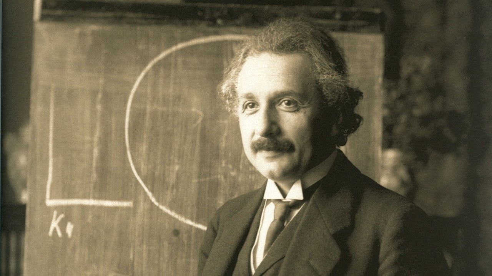

Path to Genius
==============

Genius used to be reserved for a select few naturally gifted people, or what seems to be. Based on latest research on
human capabilities, that is no longer the case. With the proper training using the right skills and techniques, anyone
can become a genius.

This step-by-step guide will take you on the path to become a genius in life with all the skills and techniques
necessary to be happy, productive, live your dreams every day, and become a genius in any field of your choosing.

If you are ready to become a genius in life, read on.

Origin, Motivation, and Value
-----------------------------

This guide is based on contents from [A Great Life Guide (hp.guide)](http://hp.guide) and
[Double Your Happiness and Productivity (double.guide)](http://double.guide) guides but structured in a step-by-step
program -- a guided path, hence it's called "Path to Genius" -- as the contents may be hard to digest in the wrong
order.

After mastery of all the steps in this guide, you will become a genius in life:

1. You can be happy whenever you want as happiness becomes a choice and gain unlimited energy to do anything you want
   even if no one believes you.
2. Your productivity will skyrocket where you can make the biggest impact with the highest growth in the least
   amount of time. In practical terms, promotions every year, more fun & time, financial freedom, no burnout, etc.
3. You will start to live your dreams today as you never know what will happen tomorrow.
4. You will be able to master any skill to be successful in your career, dreams, and life.
5. Be your true self and live the life that you want in every possible way without limits.

Genius Training Program
----------------------------

This is available as a training program for adults and kids (7+) that can be customized to what is relevant to your
needs and goals, so you will learn everything to become a genius from a genius coach.

To learn more, please book an introduction session at [http://hp.training](http://hp.training)

After completion of the program, you will receive:

1. Certificate that certifies that you are a genius in life.
2. Invitation to be a guest on our podcast [Human Prosperity](http://podcast.hp.show) to share your life story with the
   world.
3. Invitation to a private LinkedIn group `Geniuses for Good` to network with other geniuses -- top entrepreneurs, etc.

Path
----

### Introduction

Before we can become a genius in life, we have to know what life is. From a philosophical perspective,
Wikipedia has a very lengthy explanation on the [meaning of life](https://en.wikipedia.org/wiki/Meaning_of_life), but
in summary, the meaning is whatever that you want to be that makes you fulfilled, so you have full control of your
meaning and destiny -- and that's a beautiful and empowering thing. On a biological perspective, [Darwin's Theory of
Evolution](https://en.wikipedia.org/wiki/Evolution) seems sound and what that tells us is that we mutate slightly to
improve our chances of survival and therefore we are all different for a very good reason that we should appreciate.

[Oxford Languages](https://languages.oup.com/google-dictionary-en/) defines a genius as:

> A person who is exceptionally intelligent or creative, either generally or in some particular respect.

For a long time, many believed that intelligence or creativity is something that you are born with. Based on
recent researches, while genes do play a role in some cases, generally they can be trained using the right skills and
techniques as our brains and bodies are extremely adaptable and powerful. There are abundant examples in
Daniel Coyle's book [The Talent Code](https://amzn.to/3jyCis4) where he explained talent is developed with the right
combination of ignition, master coaching, and deep practice. Read more under "Skill Development" in
[double.guide](http://double.guide)

> "If people knew how hard I had to work to gain my mastery," Michelangelo later said, "it would not seem so wonderful
> at all."

With the right mindset, skills, techniques, and practice using this guide, you will become a genius in life where you
can be happy, productive, live your dreams every day, and be a genius in any field of your choosing.

### Anything is Possible

In history, there are also many examples of geniuses that started as normal or below average. Albert
Einstein was [slow in learning how to speak and had a mild form of autism](http://content.time.com/time/specials/packages/article/0,28804,1936731_1936743_1936745,00.html) when he was a child. Steve Jobs [started out as an ordinary guy that dropped out of
college](https://www.youtube.com/watch?v=UF8uR6Z6KLc), but he believed in and applied himself, then he became a genius.
Read more under "Believe In Yourself" in [double.guide](http://double.guide)

> Anything is possible if you believe in and apply yourself!

### Unshackling Chains Holding You Back

There are many artificial or archaic beliefs and emotions that hold us back, such as fear of public speaking or that we
are not smart enough. In order for us to move at full speed, we need to unshackle us from those limiting beliefs and
emotions that are holding us to the ground.

The easiest way to do that is using the most powerful emotion at our disposal: Love. Simply love yourself completely,
including your fears, flaws, and failures, and they will naturally disappear in no time. Read more under "Love Yourself"
in [double.guide](http://double.guide).

### Gain Unlimited Energy with Happiness Intelligence

[Happiness Intelligence](https://www.longdom.org/proceedings/happiness-intelligence-hq--the-ability-to-be-happy-and-its-measurement-12348.html) is the ability to be happy. Once maximized, it's possible to go back to being happy again no matter what happens
in life, so happiness becomes a choice. Being happy without dependency will essentially give you unlimited energy to do
what's right and realize your dreams -- even if no one believes in you.

To maximize your happiness intelligence, follow the happiness steps in [A Great Life Guide](http://hp.guide):

1. Sleep well
2. Let go of everything
3. Enjoy the present
4. Nurture your drives with positivity

### Gain More Time with Productivity

Time is the most precious resource as it's finite. While we can't actually create more time, we can become more
productive so that we can do more in less time, therefore effectively gaining more time.

To become productive, follow the productivity steps in [A Great Life Guide](http://hp.guide):

1. Activate your body, passion, and mind
2. Be present with acceptance
3. Concentrate on one thing at a time
4. Do the right thing

### Common Values to Ensure the Prosperity of Humanity

Sharp tools have no affinity to prosperity of humanity, hence it's important to have a common set of values to
ensure that as stated in [A Great Life Guide](http://hp.guide):

1. **Truth**: This is the foundation that everything else is built on. Without it, everything crumples.
2. **Pleasure**: We only have one life to live, so let's focus on enjoyment rather than pain. :)
3. **Unity**: This is what makes relationships. The more we unite, the greater the prosperity of humanity.

### Dreams that Make You Come Alive

All you need is happiness, but life becomes more exciting when you dream. As you have one life to live, make the most of
it by figuring out and live your dream every day. Read more under "Live Your Dream Life" in
[double.guide](http://double.guide).

Here are some tips to figure out your dream:

1. What are you most passionate about?
2. If you don't have to worry about money, what would you do?
3. What are you good at and your interests?

### Live Your Life to the Fullest Every Day

As we never know what will happen tomorrow, it's important to live each day to the fullest. In order to do that, we
should plan and do everything that's important to us in 24 hours. Carve out the number of hours that you want to spend
with your family, friends, career, hobbies, dreams, sleep, etc.

Better yet, turn that into a daily routine so you don't need think about what you need to do or forget to do something
important. Read more under "Daily Routine" in [double.guide](http://double.guide)

### Memorize Anything Instantly

With the right memory techniques, it's possible to remember massive amount of information easily. With ever growing
information, that's increasingly more important. While most things can be easily looked up, it is very useful to have
critical information readily available in your memory, which allows them to be used in a wholistic way instantly.

Use the following memory techniques to memorize different information:

1. Story/link system uses vivid images and stories that link together to memorize one or more words/concepts.
2. Loci uses locations that you know intimately to map to new words/concepts, such as your body or house.
3. Peg system maps number to words/concepts to remember them in numeric order.

Read more under "Memorization" in [double.guide](http://double.guide)

### Think Differently

Robert De Bono is the leading world thinker that has come up with many ways to improve thinking outside of traditional
logical thinking:

1. Parallel thinking is a way to use different modes of thinking in serial with others at the same time to improve
   collaboration instead of arguing against each other.
2. Lateral thinking uses the untrod paths to solve problems in creative ways.
3. Perceptional thinking lets you see things from many different angles to get a full picture.

Read more under "Thinkings" in [double.guide](http://double.guide).

It's important to have the right mindset in terms of being responsible for all your actions and results. If you
blame others for your misfortune, then you have given up control to others, so never do that. Whatever happens, always
think what "I" can do to make the situation better. Read more under "Be a Player, Not a Victim" in
[double.guide](http://double.guide).

Lastly, everyone has a different brain and way of thinking, including those with autism or other neurodiverse groups,
and that's a beautiful thing that we need to appreciate as they provide a more complete thinking rather than a few
popular ways. Read more under "Embrace Neurodiversity" in [double.guide](http://double.guide)

### Enjoy Doing Anything

The more things that you love, the more enjoyable life becomes. To be able to enjoy everything, simply love everyone and
everything. :) To enjoy doing anything, simply generate a feeling of love whenever you do it.

BJ Fogg has 3 simple steps that can be used to turn anything into a tiny habit using that concept:

1. Anchor to something that you are already doing.
2. Behavior that you want to do in the smallest increment.
3. Celebrate by generating a feeling of accomplishment.

And repeat that many times to turn the tiny habit into a big one. He also has a formula that breaks behavior into 3
simple multipliers: motivation, ability, and prompt. Read more under "Behavior Design" in
[double.guide](http://double.guide).

### Train Faster

In order to do anything faster, we must be able to learn faster first:

1. To learn faster, we should forget what we already know, act on the new content, be in a motivated mental state, learn
   again by teaching others, attach emotion, and replay it. Read more under "Learn Faster" in
   [double.guide](http://double.guide)
2. To read faster, we should silence subvocalization, read in multiple words or concepts, be concentrated, and
   optionally use a pacer. Read more under "Read Faster" in [double.guide](http://double.guide)

Try to read one book a week. Each book takes a few hours to read but will save us weeks or years of time by learning and
leveraging what others have learned from their lifetime. That is time creation and productivity in its finest. Read more
under "Leverage What Others Have Learned" in [double.guide](http://double.guide)

After reading, we need to understand how skills can be developed so that you can become an expert in
any skill of your choosing. Daniel Coyle breaks skill development into 3 components: ignition, master coaching, and
deep practice. On a biological level, as your skill develops, it means more myelin is wrapped around nerve cell axons to
allow impulses to travel hundreds of times faster. Read more under "Skill Development" in [double.guide](http://double.guide).

### Optimal State

Before we can start to do things, we need to get our mind and body into the optimal state:
1. Concentration meditation is useful for improving your focus and many others.
2. Mindfulness meditation is useful for improving your awareness and many others.
3. Loving-Kindness meditation is useful for improving your happiness and many others.
4. Exercise daily to improve physical and mental health.
5. Sleep well to fully rejuvenate.
6. Eat nutritious and top brain foods, such as salmon.

Read more under "Trainings" in [double.guide](http://double.guide)

### Optimal Execution

To do things well, we need:

1. Full concentration. To keep concentration at an optimal state, take breaks often using the Pomodoro technique.
2. Flow state where the work becomes immersive, time flies, and productivity peaks.
3. Sustained motivation by knowing why we are doing it and the rewards ahead of us.

Read more under "Optimal Concentration", "Optimal Experience", and "Hacking Motivation" in
[double.guide.](http://double.guide)

### Make the Biggest Impact

At the end of the day, it's really about the impact of your results and not about how much time was spent, therefore to
be successful in life, always think in terms of impact and personal growth for whatever you do. Read more under "Biggest
Impact & Growth" in [double.guide](http://double.guide)

To have high impact to others, you must deliver value to them. To deliver value, start by deeply understanding others'
needs, and then help them become successful. If others are successful, then they will gladly pay a premium for your
services. This applies to business and personal relationships, in non-montetary terms. Read more under "Powerfully Serve Your Customers" in [double.guide](http://double.guide)

As there are limited time, it is crucial to work on the most impactful thing first. Read more under "Prioritization" in
[double.guide](http://double.guide)

There is only so much that you can do alone, therefore, to make the biggest impact, you want to leverage your network
using transcendent leadership to multiple your impact by up to billions of times. Read more under "Transcendent Leadership" and "Network" in [double.guide](http://double.guide)

### Expression that Moves People to Action

To work well with others and get them to take action, we have to communicate effectively by:

1. Being authentic and passionate as people are moved by them.
2. Deeply understand what you are talking about.
3. Convey relevant information otherwise no one will listen.
4. Master different forms of communication to ensure information isn't lost during transit.

Afraid of public speaking? Easily overcome it with love!

Read more under "Public Speaking" and "Effective Communication" in [double.guide](http://double.guide)

### The Perfect Relationship

Essentially, everything we do comes down to the relationships that we build. The world would be pretty lonely without
good relationships.

To build the perfect relationship:

1. Interact with empathy and act with compassion. It's important to listen first with empathy to fully understand. And
   if there is a need to act, then do so with compassion, otherwise the relationship won't last long. This applies to
   personal and business relationships.
2. Understand that conflict is natural and healthy, and the problem isn't other person but the situation. To best deal
   with the situation, master negotiation techniques, such as empathy and say no without saying no.

Read more under "Compassion for Everyone" and "Every Conflict is Negotiation" in [double.guide](http://double.guide)

### Genius: Grit, Growth, Giving, Gratitude, and Good

To be a true genius in life, you must exhibit the 5Gs of Genius:

1. **Grit** is the key to success. As long as you keep on trying, success is the only outcome.
2. **Growth** is the key to self-development. If you keep growing, everything becomes easier and better.
3. **Giving** is the key to relationship and development of others. The best way to give is by sharing, especially
   teaching others to love.
4. **Gratitude** is the key to relationship and happiness. It feels good to be thankful for what you have and what
   others have done for you, and same when receiving.
5. **Good** is the key to humanity. To be a genius in life, it's essential to come to the realization that we must use
   our geniuses for the good of humanity.

Read more under "Believe In Yourself" and "Teach Love, Not How" in [double.guide](http://double.guide)

Updates
-------

This guide is updated often as I learn. To get updates, follow [Max Zheng](https://www.linkedin.com/in/maxzheng/)
or [Human Prosperity, Inc](http://hp.enginering).

Need Help?
----------

If you have any questions or interested to learn more, please book an exploratory session at
[hp.training](http://hp.training)

*The latest published version is available at http://pathtogenius.guide for easy sharing and liking.*
