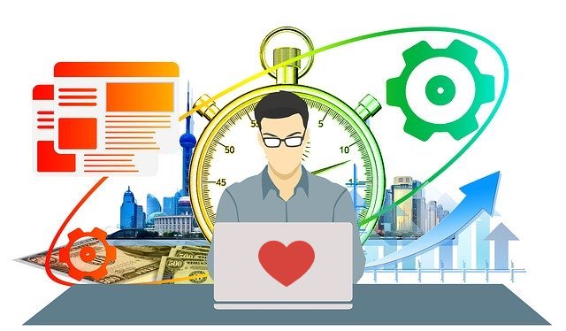

Techniques/Tips to Double Your Productivity and Happiness
=========================================================

These techniques/tips will at least double your productivity and happiness, so try them today:

* 5 Memorization
* 7 Execution
* 3 Meditation
* 2 Empowerment

Memorizations
-------------

Did you know you can easily remember vast amount of information quickly and easily? It's just a
matter of knowing how to do it. Your age or how well you can naturally remember things don't matter. Everyone can do it!
Once you know the technique, you could easily [learn a new language](https://www.smithsonianmag.com/smart-news/how-to-learn-a-language-in-less-than-24-hours-122194358/) in a day!

The memory techniques here can be combined together to remember massive and different kind of information easily.
All you have to do open your mind and give it a try!

### #1 How Memory Works

Memory works by associating what you already know and
[visual memory](https://www.shiftelearning.com/blog/bid/350326/studies-confirm-the-power-of-visuals-in-elearning)
is magnitudes better than other types of memory.
All memory techniques work based on those two facts to enable you to remember unlimited amount of information easily!

### #2 MOM

[MOM](https://jimkwik.com/kwik-brain-002/) will get you started on your memory journey:

* **Motivation**: To remember anything, there must be motivation. If you don't care, then it won't be remembered for
 long.
* **Observation**: Be mindful and concentrate to fully see and understand what you want to remember. If you don't see
 and understand, then there is nothing to remember.
* **Methods**: Use effective memorization techniques below as rote memorization is the least effective, but
 unfortunately is also the most widely used.

### #3 Story/Link System

[Story/Link System](https://en.wikipedia.org/wiki/Mnemonic_link_system) is easy and effective to remember ordered list
of items by creating a story with vivid images for each item.

Let's say we want to remember this list:

>    concentration, mindfulness, loving-kindness, prioritization, Pomodoro, Flow, FASTER, Tiny Habits.

You can easily do that by **visualizing the following story in your mind**:

>   In your room, imagine a con (**concentration**) man walks in to put a land mine
>   (**mindfulness**) in the middle of the room. You say to him "can you kindly (**loving-kindness**) leave please?"
>   So he looks at his watch and says "oh snap, I forgot about a prior (**prioritization**) engagement," and leaves while
>   taking your **Pomodoro** timer. You tried to follow (**Flow**) him, but he is **Faster** with his tiny hobbit feets
>   (**Tiny Habits**).

Now, close your eyes, and replay the story in your mind, and say the words from the list out loud as you do.
Congrats, you have just master the technique! The story can be as long as you need to remember an unlimited # of
items. The beauty of this is that you will be able to remember the story for a long time with just one iteration. To
make it more memorable, re-iterate with more vivid and wild images and make sure there is a strong link from one word
to the next.

### #4 Loci Method

[Loci Method](https://en.wikipedia.org/wiki/Method_of_loci) uses locations to associate to ordered or unordered
information that you want to remember. Location can be things in your room, your office, your body, your
neighborhood, or anything else that you know intimately. The idea is to put what you want to remember to each
location by doing a one-to-one mapping.

Let's try to remember a list of top 10 brain foods:

>    avocado, egg, walnut, blueberries, broccoli, coconut oil, leafy greens, tumeric, chocolate, fish

Map each of those items to our body like so by **visualizing them in your mind**:

* Avocado on top of egg head
* Crack the egg head to get walnuts inside
* Coconut oil coming out of your ears
* Blueberries coming out of your nose
* Brocolli coming out of your bronchus
* Leafy greens around your neck
* Your fingers are replaced by tumerics
* Chocolate coming out of your butt
* Your feet smells like stinky fish

Now, you can go to any place on your body to find the item or go from top to bottom to get the full list.

### #5 Peg System

[Peg System](https://en.wikipedia.org/wiki/Mnemonic_peg_system) can be used to map items to numbers, which can be
useful for ordered or random retrieval. The idea is to map numbers to a word/image and then map that word/image to
what you want to remember.

First, we need to map numbers to a word/image, let's use these -- but you should use whatever comes natural to
you when you think of each number:

* Zero: Hero
* One: Sun
* Two: Twin
* Three: Tree
* Four: Door
* Five: Hive
* Six: Sticks
* Seven: Heaven
* Eight: Gate
* Nine: Vine

Then, remember the list of top brain foods in order like this by **visualizing them in your mind**:

* Hero eating avocado for breakfast
* Sun cooking egg on pavement
* Twin babies are climbing up walls and driving mom nuts (walnuts)
* Tree has lots of coconuts [oil]
* Door is made of blueberries
* Hives are being stuffed by bees with broccolis
* Sticks have leafy green vegetables on it over a fire
* Heaven is passing out free tumerics
* Gate guard demands chocolate on entry
* Vine is wrapped around a fish.

Now, you can think of a number, which would map to the word/image, and from that, you can get the brain food. Randomly
select a number and you would get random access to any item. This method can be used to remember people's phone number
as well by making a story using those words starting with the person whose phone number you want to remember.

See [other techniques](https://en.wikipedia.org/wiki/Memorization).

Executions
----------

These techniques will help you learn and do everything in half the time and double the enjoyment, so that you can have
more time to do anything else you like!

### #1 FASTER

[FASTER by Jim Qwik](https://jimkwik.com/kwik-brain-001/) will help you learn faster and more effectively:

* **Forget** everything you know so they don't interfere with what you are about to learn.
* **Act** as you read by taking notes, memorize important content using memorization techiques, share with others. By
 doing active reading, you will remember better and gain better understanding.
* **State** of your mind matters. Make sure you are excited and motivated about the topic. Understand why you need to
 know and how it will be useful to you in the future. You will forget what you don't care sooner or later, but will
 remember things that matter to you for a life time.
* **Teach** others to further re-learn the content from another perspective.
* **Enter** to your calender as a reminder to keep learning and don't let yourself forget due to busy schedule.
* **Recall** what you know once awhile to re-enforce what you remembered.

Apply **FASTER** to your reading, studying, or whenever you are learning to learn faster!

### #2 Speed Reading

Here are a couple of different ways to [improve your reading speed](https://jimkwik.com/kwik-brain-007/):

1. Comprehension must come first before trying to increase your speed, otherwise there is no point going faster.
   To increase comprehension, it requires full concentration and use the **FASTER** and memory techniques to remember
   what you read.
2. Stop the subvocalization in your head as it reduces the reading speed to your speaking speed, which is much slower
   than your comprehension speed.
3. Use your finger as a pacer under the words you are reading, which can quickly increase your reading speed from 25% to
   100%. Read where your finger is and move your finger faster and faster, and then you will naturally start to read
   faster and reduce subvocalization too.
4. Read in [multiple words (single cohesive idea)](https://www.amazon.com/Speed-Reading-Right-Brain-Instead-ebook/dp/B00O3OD5WY)
   instead of one word at a time by grouping related words into a single idea or visual (e.g. super hero).

### #3 Prioritization

[Prioritize](https://www.ctl.life/2018/03/too-many-things-to-do-5-simple-steps-to.html) work based on their value and
work on the most valueable things first as time is limited, so you can get the most bang for your time. For projects,
use **TBD** to enable prioritization to maximize business impact:

* **Timeline Expectation** from stakeholders so projects are done on time.
* **Business Value** if the project is completed. Work on the highest value over cost ratio first!
* **Deliverables** for scoping the output to estimate effort and to align with stakeholders.

### #4 Pomodoro

[Pomodoro](https://jimkwik.com/kwik-brain-019/) can be used to ensure concentration is at max when doing
work. Your ability to concentrate wanes after 30 minutes, so the idea is to take a break after 25 minutes of
concentrated work to reset using a timer. Instead of a timer, alternatively, use mindfulness to check your
concentration and mental/body energy once awhile and take a break/refuel when it is not 100%. Be sure to drink plenty
of water and snack on some brain foods!

### #5 Flow

[Flow](https://jimkwik.com/kwik-brain-020/) can be used to fully emerse yourself in your work with
absolute passion and concentration, the work becomes so fun that time simply flies as your productivity sky rockets
to new heights!! This is the pinnacle of productivity and the final state that you want to achieve to get things done
fast with high quality!

To get into the state, these conditions must be met (**FGCT**):
* **Feedbacks**: There should be immediate positive feedback to your brain from what you are doing, so it
 would want to continue to get more of it, and eventually leading to flow state.
* **Goal**: There must be a clear goal in mind, otherwise the mind would wander. The more specific the better.
* **Challenging**: The work should be challenging, but not too hard. Too easy, then there is no need for flow state.
 Too hard, then it won't flow. There is a sweet spot somewhere. If the challenge is too hard, break it down into
 something easier. If it is too easy, well, find something more challenging to do, LOL!
* **Time**: It takes about 15 to 45 minutes of concentrated work to get into the flow state, so don't
 let yourself be distracted during that time. The use of Pomodoro timer is fine, but can be skipped after you get
 into or if it affects your flow state.

Listening to your favorite music can help too.

### #6 Tiny Habits

[Tiny Habits by BJ Fogg, PhD](https://amzn.to/37YyHyK) can be used to build good habits to automate your life, which
can be used to improve your health and learning.

Easily create new habits using **ABC**:
* **Anchor**: Find something that you already do
* **Behavior**: Do something small that you want to become a habit
* **Celebrate**: Generate a good feeling and praise yourself.

For example, to build a habit of doing exercise in the morning after you get a drink of water (something you already
do), then immediately do something small towards your exercise goals (such as putting on shoes or taking one step),
and finally make yourself feel good and praise yourself for completing the small step. Repeat the same process
several times, and it will become a tiny habit. Repeat it to do more each time, then it can become a big habit.

Use **B=MAP** (Behavior = Motivation * Ability * Prompt) to easily change an existing one. Want to reduce picking up
your phone to check msgs? Make it harder to access your phone (reduce ability).

Additional Resources: [YouTube Video](https://www.youtube.com/watch?v=AdKUJxjn-R8),
                     [Kwik Brain Podcast](https://podcasts.apple.com/us/podcast/182-tiny-habit-to-change-your-life-with-dr-bj-fogg/id1208024744?i=1000478036542)

### #7 Public Speaking

[Jeff
Weiner has 3 golden rules](https://www.linkedin.com/pulse/20121022044446-22330283-from-crickets-chirping-to-a-standing-ovation-three-rules-of-effective-public-speaking/):

* **Know your audience**: Different audiences have different goals and the content needs to be relevant and valuable to
  them.
* **Know your material**: The reason they are listening to you is because you know about the topic more than them,
  otherwise there is no reason for them to be there.
* **Know your passion**: The most interesting topic presented without enthusiasm will put people to sleep. The most
  boring topic will come alive when presented and infused with passion as it is transferred to your audience.

[Julian Treasure suggests speaking using **HAIL**](https://www.youtube.com/watch?v=eIho2S0ZahI) so people will listen:

* **Honesty**: The truth matters and lies don't.
* **Authenticity**: Be yourself as they came to hear from **you**.
* **Integrity**: Do what you say otherwise they will feel betrayed
* **Love**: Show that you care and they will care about what you say

Meditations
-----------

Use these techniques to improve your concentration, awareness, compassion, gratitude, and reduce negativities (e.g.
stress, anger), which will greatly improve your mental health, memorization, execution, relationships, leadership,
happiness, and the ability to enjoy life!

### #1 Concentration Meditation

[Concentration Meditation](https://www.wikihow.com/Do-Concentration-Meditation) will improve your concentration and
reduce stress, therefore improving your memory, execution, and health.

Sit/lay down in a comfortable spot, relax your body, and focus on your breath or anything else as long
as it doesn't change. If any thoughts or other distractions comes up, just gently let them go and return to the
object of focus -- this is natural and will always happen, so no need to fight it. It takes time to master this
skill.

### #2 Mindfulness Meditation

[Mindfulness Meditation](https://www.wikihow.com/Do-Mindful-Meditation) will improve your awareness, concentration,
and reduce stress, therefore improving your ability to perceive, understand, and enjoy life.

Either sit/lay down in a comfortable spot or while you do things during the day in any position, relax yourself, and
bring your focus to what you are doing to fully enjoy it and then diffuse the focus to everything around you to fully
take them in and appreciate the beauty. Shift your focus to your different senses so you don't miss anything. For any
emotion or thought that comes up, enjoy, accept, let them go and don't let them affect you. Scan your body from top
to bottom once awhile to feel the sensations, relax, and put them into the correct posture. This can be done while
you exercise, sitting in front of your desk while working, walking to the bathroom, etc. You will start to see the
world anew and notice things that was once ignored.

### #3 Loving-Kindness Meditation

[Loving-Kindess Meditation](https://www.wikihow.com/Practice-Loving-Kindness-Meditation-%28Metta%29) will improve
your compassion, gratitude, concentration, and reduce negativities, therefore improving your relationships,
leadership, and happiness.

Sit/lay down in a comfortable spot, relax your body, and acknowledge that you are a person and you deserve to be
happy just like everyone else, forgive yourself for any wrongdoing, praise yourself for the good things you have
done, thank yourself for what you contribute to others, and finally extend agape and well wishes to yourself. Now
repeat the same steps for some people you love, some you had conflicts with, and some that you don't know that well.

Empowerments
------------

You can achieve your dreams -- the only requirement is that you have to believe in and apply yourself!

### #1 Believe

Believe in yourself. And if you don't believe yourself, how do you expect others to do that? While it might seem
insignificant, but it has massive impact on what you can accomplish as your brain will wire itself based on what you
believe. If you believe it is not possible to remember massive amount of information or become a genius, then you
won't. If you believe the world is flat, then it is. If you don't believe it is possible to fly into space, then you
won't. But if you do believe you can do anything by applying yourself using the right techniques, then you will!
Believe is scientifically proven to [alter the effects of medication, diet, exercise, and even stress](https://www.youtube.com/watch?v=0tqq66zwa7g). So believe in yourself and posivity in everything and everyone and that's what you will get.

[Limitless by Jim Qwik](https://amzn.to/37NVptj) is the best book ever written and is also the mindset that you want
to have when it comes to what you can do. There is no essentially limit to your brain's ability to abstract, process,
and remember information. While your body has physical limits, but it is pretty adaptive and amazing. Both your body
and mind can be trained and it will change to adapt to your all your needs, known as
[neutroplasticity](https://en.wikipedia.org/wiki/Neuroplasticity).

The only [differences between an average person and a genius](https://jimkwik.com/kwik-brain-032/) are:

* **Growth**: You must have a growth and limitless mindset where you are motivated to learn and become better each
 day. The techniques in this article will get you started.
* **Giving**: Teach others what you have learned so everyone becomes better. Someone had to teach you.
* **Gratitude**: Be thankful for everything you have got and everyone that have helped you be the awesome person you
 are today. It takes a village to raise a child.
* **Grit**: It's not a matter of knowing, but you must do it and never stop. Perserverance is key and
 things do get easier, especially if you use the techniques in this article.

[Steve Jobs believed](https://www.youtube.com/watch?v=UF8uR6Z6KLc) everyone can do what he does and had the same
mindset. So you just need to believe too, and you can also become a genius and do anything you want.

### #2 Happiness

Happiness is an internal state that you can decide and must be that way to ensure you have unlimited energy to be
productive. If you are not happy at all, productivity goes to zero. It is the single most significant factor to
productivity. To be happy and productive at all times, simply follow [A Great Life Guide](http://agreatlife.guide/).

*To get more techniques/tips, [follow/connect with me](https://www.linkedin.com/in/maxzheng/)!*
